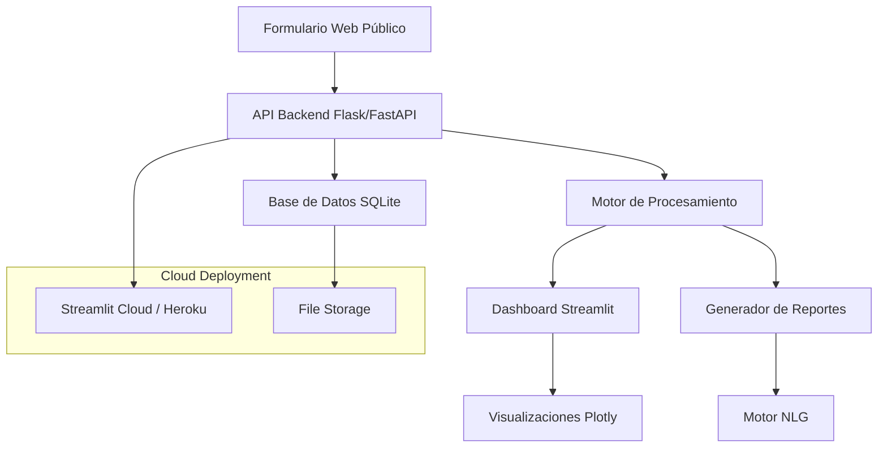

# Design Document

## Overview

El Sistema de Reportes Docentes es una aplicación web full-stack de Data Science construida con Python que integra recolección de datos, procesamiento analítico, visualización interactiva y generación automática de reportes. La arquitectura está diseñada para ser desplegada en plataformas cloud gratuitas como Streamlit Cloud o Heroku, utilizando una base de datos SQLite para simplicidad y portabilidad.

## Architecture

### High-Level Architecture



### Technology Stack

**Frontend:**
- Streamlit para el dashboard administrativo y visualizaciones
- HTML/CSS/JavaScript vanilla para el formulario público
- Plotly para gráficas interactivas

**Backend:**
- Python 3.9+
- FastAPI para la API REST
- SQLAlchemy para ORM
- Pandas para procesamiento de datos
- Pydantic para validación de datos

**Data Processing:**
- Pandas para limpieza y transformación
- NumPy para cálculos estadísticos
- Scikit-learn para detección de duplicados
- NLTK/spaCy para procesamiento de texto

**Report Generation:**
- Jinja2 para templates de reportes
- ReportLab para generación de PDFs
- OpenPyXL para archivos Excel
- python-pptx para PowerPoint

**Deployment:**
- Streamlit Cloud (opción principal)
- Heroku (alternativa)
- SQLite como base de datos
- Git para versionado

## Components and Interfaces

### 1. Formulario Web Público (Public Form Component)

**Responsabilidades:**
- Renderizar formulario HTML dinámico
- Validación client-side básica
- Envío de datos via AJAX
- Manejo de campos múltiples dinámicos

**Interfaces:**
```python
class FormData(BaseModel):
    nombre_completo: str
    correo_institucional: EmailStr
    cursos_capacitacion: List[CursoCapacitacion]
    publicaciones: List[Publicacion]
    eventos_academicos: List[EventoAcademico]
    diseno_curricular: List[DisenoCurricular]
    movilidad: List[ExperienciaMovilidad]
    reconocimientos: List[Reconocimiento]
    certificaciones: List[Certificacion]
    fecha_envio: datetime
```

### 2. API Backend (Backend API Component)

**Responsabilidades:**
- Recibir y validar datos del formulario
- Gestionar estados de formularios (pendiente/aprobado/rechazado)
- Proporcionar endpoints para el dashboard
- Autenticación básica para administradora

**Endpoints principales:**
```python
POST /api/formulario/enviar
GET /api/admin/formularios/pendientes
PUT /api/admin/formulario/{id}/aprobar
PUT /api/admin/formulario/{id}/rechazar
GET /api/admin/metricas
GET /api/admin/datos/exportar
```

### 3. Motor de Procesamiento (Data Processing Engine)

**Responsabilidades:**
- Limpieza y normalización de datos
- Detección de duplicados
- Cálculo de métricas por período
- Agregación de estadísticas

**Clases principales:**
```python
class DataProcessor:
    def clean_data(self, raw_data: List[FormData]) -> pd.DataFrame
    def detect_duplicates(self, df: pd.DataFrame) -> pd.DataFrame
    def calculate_metrics(self, df: pd.DataFrame, period: str) -> Dict
    def generate_statistics(self, df: pd.DataFrame) -> Dict

class MetricsCalculator:
    def calculate_quarterly_metrics(self, df: pd.DataFrame, quarter: int, year: int)
    def calculate_annual_metrics(self, df: pd.DataFrame, year: int)
    def compare_periods(self, current: Dict, previous: Dict)
```

### 4. Dashboard Administrativo (Admin Dashboard Component)

**Responsabilidades:**
- Mostrar formularios pendientes de revisión
- Proporcionar interfaz de aprobación/rechazo
- Visualizar métricas y estadísticas
- Filtros interactivos por período y categoría

**Páginas principales:**
- Página de revisión de formularios
- Dashboard de métricas generales
- Visualizaciones por categoría
- Página de exportación de datos

### 5. Generador de Reportes (Report Generator Component)

**Responsabilidades:**
- Generar reportes narrativos usando NLG
- Crear reportes tabulares con datos duros
- Exportar en múltiples formatos (PDF, Excel, PowerPoint)
- Mantener historial de reportes

**Clases principales:**
```python
class ReportGenerator:
    def generate_annual_narrative(self, data: Dict) -> str
    def generate_quarterly_summary(self, data: Dict) -> str
    def export_to_pdf(self, content: str, charts: List) -> bytes
    def export_to_excel(self, data: Dict) -> bytes
    def export_to_powerpoint(self, content: str, charts: List) -> bytes

class NLGEngine:
    def create_narrative_text(self, metrics: Dict) -> str
    def format_statistics(self, stats: Dict) -> str
    def generate_insights(self, trends: Dict) -> str
```

## Data Models

### Core Models

```python
class Docente(BaseModel):
    id: int
    nombre_completo: str
    correo_institucional: str
    fecha_registro: datetime

class FormularioEnvio(BaseModel):
    id: int
    docente_id: int
    estado: EstadoFormulario  # PENDIENTE, APROBADO, RECHAZADO
    fecha_envio: datetime
    fecha_revision: Optional[datetime]
    revisado_por: Optional[str]
    datos_json: str  # JSON serializado de todos los campos

class CursoCapacitacion(BaseModel):
    id: int
    formulario_id: int
    nombre_curso: str
    fecha: date
    horas: int

class Publicacion(BaseModel):
    id: int
    formulario_id: int
    autores: str
    titulo: str
    evento_revista: str
    estatus: EstatusPublicacion  # ACEPTADO, EN_REVISION, PUBLICADO

class EventoAcademico(BaseModel):
    id: int
    formulario_id: int
    nombre_evento: str
    fecha: date
    tipo_participacion: TipoParticipacion  # ORGANIZADOR, PARTICIPANTE

class DisenoCurricular(BaseModel):
    id: int
    formulario_id: int
    nombre_curso: str
    descripcion: Optional[str]

class ExperienciaMovilidad(BaseModel):
    id: int
    formulario_id: int
    descripcion: str
    tipo: TipoMovilidad  # NACIONAL, INTERNACIONAL
    fecha: date

class Reconocimiento(BaseModel):
    id: int
    formulario_id: int
    nombre: str
    tipo: TipoReconocimiento  # GRADO, PREMIO, DISTINCION
    fecha: date

class Certificacion(BaseModel):
    id: int
    formulario_id: int
    nombre: str
    fecha_obtencion: date
    fecha_vencimiento: Optional[date]
    vigente: bool
```

### Database Schema

```sql
-- Tabla principal de formularios
CREATE TABLE formularios_envio (
    id INTEGER PRIMARY KEY AUTOINCREMENT,
    nombre_completo TEXT NOT NULL,
    correo_institucional TEXT NOT NULL,
    estado TEXT DEFAULT 'PENDIENTE',
    fecha_envio DATETIME DEFAULT CURRENT_TIMESTAMP,
    fecha_revision DATETIME,
    revisado_por TEXT,
    datos_json TEXT NOT NULL
);

-- Tablas normalizadas para cada categoría
CREATE TABLE cursos_capacitacion (
    id INTEGER PRIMARY KEY AUTOINCREMENT,
    formulario_id INTEGER REFERENCES formularios_envio(id),
    nombre_curso TEXT NOT NULL,
    fecha DATE NOT NULL,
    horas INTEGER NOT NULL
);

-- [Tablas similares para otras categorías...]
```

## Error Handling

### Validation Errors
- Validación de campos obligatorios en frontend y backend
- Validación de formatos de email y fechas
- Manejo de datos malformados en JSON

### Database Errors
- Manejo de conexiones perdidas
- Rollback automático en transacciones fallidas
- Logging detallado de errores de base de datos

### Processing Errors
- Manejo de datos inconsistentes durante limpieza
- Recuperación graceful de errores en cálculos de métricas
- Fallbacks para generación de reportes

### API Errors
```python
class APIError(Exception):
    def __init__(self, message: str, status_code: int = 400):
        self.message = message
        self.status_code = status_code

class ValidationError(APIError):
    def __init__(self, field: str, message: str):
        super().__init__(f"Validation error in {field}: {message}", 422)

class ProcessingError(APIError):
    def __init__(self, message: str):
        super().__init__(f"Processing error: {message}", 500)
```

## Testing Strategy

### Unit Testing
- Pytest para testing de funciones de procesamiento
- Mocking de base de datos para tests aislados
- Tests de validación de modelos Pydantic
- Coverage mínimo del 80%

### Integration Testing
- Tests de endpoints de API con base de datos de prueba
- Tests de flujo completo de formulario a reporte
- Validación de exportación de archivos

### User Acceptance Testing
- Tests manuales del formulario público
- Validación de dashboard con datos reales
- Verificación de calidad de reportes generados

### Performance Testing
- Tests de carga para formularios concurrentes
- Benchmarking de procesamiento de datos grandes
- Optimización de consultas de base de datos

## Deployment Architecture

### Streamlit Cloud Deployment
```yaml
# streamlit_config.toml
[server]
port = 8501
enableCORS = false
enableXsrfProtection = false

[browser]
gatherUsageStats = false

[theme]
primaryColor = "#1f77b4"
backgroundColor = "#ffffff"
secondaryBackgroundColor = "#f0f2f6"
```

### Environment Configuration
```python
# config.py
import os
from pydantic import BaseSettings

class Settings(BaseSettings):
    database_url: str = "sqlite:///./reportes_docentes.db"
    secret_key: str = os.getenv("SECRET_KEY", "dev-secret-key")
    admin_password: str = os.getenv("ADMIN_PASSWORD", "admin123")
    environment: str = os.getenv("ENVIRONMENT", "development")
    
    class Config:
        env_file = ".env"
```

### File Structure
```
sistema-reportes-docentes/
├── app/
│   ├── __init__.py
│   ├── main.py              # FastAPI app
│   ├── models/              # Pydantic models
│   ├── api/                 # API endpoints
│   ├── core/                # Core business logic
│   ├── database/            # Database setup
│   └── utils/               # Utility functions
├── dashboard/
│   ├── streamlit_app.py     # Main dashboard
│   ├── pages/               # Dashboard pages
│   └── components/          # Reusable components
├── static/
│   ├── form.html            # Public form
│   ├── css/
│   └── js/
├── templates/               # Report templates
├── tests/
├── requirements.txt
├── Procfile                 # For Heroku
└── README.md
```

## Security Considerations

### Data Protection
- Validación estricta de inputs para prevenir inyección
- Sanitización de datos antes de almacenamiento
- Encriptación de datos sensibles en base de datos

### Access Control
- Autenticación básica para panel administrativo
- Rate limiting en endpoints públicos
- CORS configurado apropiadamente

### Privacy Compliance
- Anonimización opcional de datos exportados
- Políticas de retención de datos
- Consentimiento explícito en formulario público