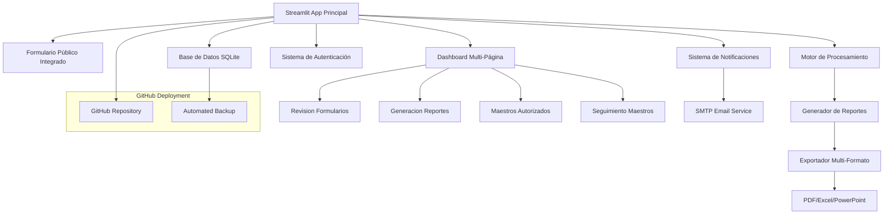

# Design Document

## Overview

El Sistema de Reportes Docentes es una aplicación web completa construida con Streamlit que integra formulario público, dashboard administrativo multi-página, procesamiento de datos, visualizaciones interactivas y generación automática de reportes en múltiples formatos. La arquitectura utiliza Streamlit como framework principal, SQLite con SQLAlchemy como ORM, y está optimizada para despliegue en GitHub con respaldo automático.

## Architecture

### High-Level Architecture



### Technology Stack

**Frontend & Backend Unificado:**
- Streamlit 1.28+ como framework principal para UI y lógica de negocio
- Streamlit Pages para navegación multi-página
- Plotly para visualizaciones interactivas
- Streamlit Components para funcionalidades avanzadas

**Base de Datos y ORM:**
- SQLite como base de datos principal
- SQLAlchemy 2.0+ para ORM y gestión de modelos
- Alembic para migraciones de base de datos
- Pydantic para validación de datos y schemas

**Procesamiento de Datos:**
- Pandas para manipulación y análisis de datos
- NumPy para cálculos estadísticos
- Python datetime para manejo de fechas y períodos
- Custom metrics calculator para estadísticas específicas

**Generación de Reportes:**
- ReportLab para generación de PDFs con gráficos
- OpenPyXL para archivos Excel con formato
- python-pptx para presentaciones PowerPoint
- Markdown nativo para reportes de texto

**Notificaciones y Comunicación:**
- smtplib para envío de emails
- email.mime para construcción de mensajes
- Custom notification system para recordatorios

**Despliegue y Versionado:**
- GitHub para repositorio y respaldo automático
- run_unified.py como punto de entrada único
- Configuración de entorno con archivos .env
- Logging integrado para auditoría y debugging

## Components and Interfaces

### 1. Aplicación Principal Streamlit (Main Streamlit App)

**Responsabilidades:**
- Gestionar navegación entre formulario público y dashboard admin
- Manejar autenticación y sesiones de usuario
- Coordinar acceso a base de datos y procesamiento
- Proporcionar punto de entrada unificado

**Archivo Principal:**
```python
# dashboard/streamlit_app.py
def main():
    # Detectar modo (público vs admin) basado en query params
    # Mostrar formulario público o dashboard según contexto
    # Manejar autenticación para funciones administrativas

def show_public_form():
    # Formulario integrado en Streamlit con pestañas
    
def show_admin_dashboard():
    # Dashboard multi-página con navegación automática
```

### 2. Formulario Público Integrado (Integrated Public Form)

**Responsabilidades:**
- Renderizar formulario Streamlit con pestañas por categoría
- Validación en tiempo real con feedback inmediato
- Manejo de campos múltiples con botones dinámicos
- Versionado automático de envíos

**Estructura de Datos:**
```python
class FormularioEnvioDB(Base):
    id: int
    nombre_completo: str
    correo_institucional: str
    año_academico: int
    trimestre: str
    estado: EstadoFormularioEnum
    version: int
    es_version_activa: bool
    fecha_envio: datetime
    # Relaciones con todas las categorías de actividades
```

### 3. Página de Revisión de Formularios (Form Review Page)

**Responsabilidades:**
- Mostrar lista de formularios pendientes con filtros
- Proporcionar vista detallada por pestañas de actividades
- Gestionar aprobación/rechazo con confirmación
- Mantener auditoría de decisiones administrativas

**Archivo:** `dashboard/pages/revision_formularios.py`
```python
def show_form_review():
    # Lista de formularios pendientes con filtros
    # Vista detallada con pestañas por categoría
    # Botones de aprobar/rechazar con confirmación
    # Estadísticas de revisión y progreso
```

### 4. Página de Generación de Reportes (Report Generation Page)

**Responsabilidades:**
- Generar reportes anuales narrativos y trimestrales resumidos
- Exportar en múltiples formatos (PDF, Excel, PowerPoint, Markdown)
- Crear títulos dinámicos según tipo de reporte seleccionado
- Mantener historial de reportes generados con metadatos

**Archivo:** `dashboard/pages/generacion_reportes.py`
```python
def generate_annual_narrative_report():
    # Reporte anual detallado con ejemplos específicos
    
def generate_quarterly_narrative_report():
    # Resumen trimestral con todas las actividades sin "ejemplo:"
    
def generate_powerpoint_content():
    # PowerPoint desde cero con títulos dinámicos
    # Formato: "Informe de Actividades 2025" o "Informe de Actividades Trimestral Q4 2025"
```

### 5. Sistema de Gestión de Maestros (Teacher Management System)

**Responsabilidades:**
- Gestionar lista de maestros autorizados
- Rastrear estado de envío de formularios por docente
- Enviar notificaciones y recordatorios por email
- Mantener historial de comunicaciones

**Archivos:**
- `dashboard/pages/maestros_autorizados.py` - Gestión de maestros
- `dashboard/pages/seguimiento_maestros.py` - Seguimiento y notificaciones
```python
class MaestroAutorizado:
    # Gestión completa de maestros con validación de emails
    
class NotificationSystem:
    # Sistema SMTP para envío de recordatorios automáticos
```

### 4. Dashboard Administrativo (Admin Dashboard Component)

**Responsabilidades:**
- Mostrar formularios pendientes de revisión
- Proporcionar interfaz de aprobación/rechazo
- Visualizar métricas y estadísticas
- Filtros interactivos por período y categoría

**Páginas principales:**
- Página de revisión de formularios
- Dashboard de métricas generales
- Visualizaciones por categoría
- Página de exportación de datos

### 5. Generador de Reportes (Report Generator Component)

**Responsabilidades:**
- Generar reportes narrativos usando NLG
- Crear reportes tabulares con datos duros
- Exportar en múltiples formatos (PDF, Excel, PowerPoint)
- Mantener historial de reportes

**Clases principales:**
```python
class ReportGenerator:
    def generate_annual_narrative(self, data: Dict) -> str
    def generate_quarterly_summary(self, data: Dict) -> str
    def export_to_pdf(self, content: str, charts: List) -> bytes
    def export_to_excel(self, data: Dict) -> bytes
    def export_to_powerpoint(self, content: str, charts: List) -> bytes

class NLGEngine:
    def create_narrative_text(self, metrics: Dict) -> str
    def format_statistics(self, stats: Dict) -> str
    def generate_insights(self, trends: Dict) -> str
```

## Data Models

### Core Models

```python
class Docente(BaseModel):
    id: int
    nombre_completo: str
    correo_institucional: str
    fecha_registro: datetime

class FormularioEnvio(BaseModel):
    id: int
    docente_id: int
    estado: EstadoFormulario  # PENDIENTE, APROBADO, RECHAZADO
    fecha_envio: datetime
    fecha_revision: Optional[datetime]
    revisado_por: Optional[str]
    datos_json: str  # JSON serializado de todos los campos

class CursoCapacitacion(BaseModel):
    id: int
    formulario_id: int
    nombre_curso: str
    fecha: date
    horas: int

class Publicacion(BaseModel):
    id: int
    formulario_id: int
    autores: str
    titulo: str
    evento_revista: str
    estatus: EstatusPublicacion  # ACEPTADO, EN_REVISION, PUBLICADO

class EventoAcademico(BaseModel):
    id: int
    formulario_id: int
    nombre_evento: str
    fecha: date
    tipo_participacion: TipoParticipacion  # ORGANIZADOR, PARTICIPANTE

class DisenoCurricular(BaseModel):
    id: int
    formulario_id: int
    nombre_curso: str
    descripcion: Optional[str]

class ExperienciaMovilidad(BaseModel):
    id: int
    formulario_id: int
    descripcion: str
    tipo: TipoMovilidad  # NACIONAL, INTERNACIONAL
    fecha: date

class Reconocimiento(BaseModel):
    id: int
    formulario_id: int
    nombre: str
    tipo: TipoReconocimiento  # GRADO, PREMIO, DISTINCION
    fecha: date

class Certificacion(BaseModel):
    id: int
    formulario_id: int
    nombre: str
    fecha_obtencion: date
    fecha_vencimiento: Optional[date]
    vigente: bool
```

### Database Schema

```sql
-- Tabla principal de formularios
CREATE TABLE formularios_envio (
    id INTEGER PRIMARY KEY AUTOINCREMENT,
    nombre_completo TEXT NOT NULL,
    correo_institucional TEXT NOT NULL,
    estado TEXT DEFAULT 'PENDIENTE',
    fecha_envio DATETIME DEFAULT CURRENT_TIMESTAMP,
    fecha_revision DATETIME,
    revisado_por TEXT,
    datos_json TEXT NOT NULL
);

-- Tablas normalizadas para cada categoría
CREATE TABLE cursos_capacitacion (
    id INTEGER PRIMARY KEY AUTOINCREMENT,
    formulario_id INTEGER REFERENCES formularios_envio(id),
    nombre_curso TEXT NOT NULL,
    fecha DATE NOT NULL,
    horas INTEGER NOT NULL
);

-- [Tablas similares para otras categorías...]
```

## Error Handling

### Validation Errors
- Validación de campos obligatorios en frontend y backend
- Validación de formatos de email y fechas
- Manejo de datos malformados en JSON

### Database Errors
- Manejo de conexiones perdidas
- Rollback automático en transacciones fallidas
- Logging detallado de errores de base de datos

### Processing Errors
- Manejo de datos inconsistentes durante limpieza
- Recuperación graceful de errores en cálculos de métricas
- Fallbacks para generación de reportes

### API Errors
```python
class APIError(Exception):
    def __init__(self, message: str, status_code: int = 400):
        self.message = message
        self.status_code = status_code

class ValidationError(APIError):
    def __init__(self, field: str, message: str):
        super().__init__(f"Validation error in {field}: {message}", 422)

class ProcessingError(APIError):
    def __init__(self, message: str):
        super().__init__(f"Processing error: {message}", 500)
```

## Testing Strategy

### Unit Testing
- Pytest para testing de funciones de procesamiento
- Mocking de base de datos para tests aislados
- Tests de validación de modelos Pydantic
- Coverage mínimo del 80%

### Integration Testing
- Tests de endpoints de API con base de datos de prueba
- Tests de flujo completo de formulario a reporte
- Validación de exportación de archivos

### User Acceptance Testing
- Tests manuales del formulario público
- Validación de dashboard con datos reales
- Verificación de calidad de reportes generados

### Performance Testing
- Tests de carga para formularios concurrentes
- Benchmarking de procesamiento de datos grandes
- Optimización de consultas de base de datos

## Deployment Architecture

### Streamlit Cloud Deployment
```yaml
# streamlit_config.toml
[server]
port = 8501
enableCORS = false
enableXsrfProtection = false

[browser]
gatherUsageStats = false

[theme]
primaryColor = "#1f77b4"
backgroundColor = "#ffffff"
secondaryBackgroundColor = "#f0f2f6"
```

### Environment Configuration
```python
# config.py
import os
from pydantic import BaseSettings

class Settings(BaseSettings):
    database_url: str = "sqlite:///./reportes_docentes.db"
    secret_key: str = os.getenv("SECRET_KEY", "dev-secret-key")
    admin_password: str = os.getenv("ADMIN_PASSWORD", "admin123")
    environment: str = os.getenv("ENVIRONMENT", "development")
    
    class Config:
        env_file = ".env"
```

### File Structure
```
sistema-reportes-docentes/
├── app/
│   ├── __init__.py
│   ├── main.py              # FastAPI app
│   ├── models/              # Pydantic models
│   ├── api/                 # API endpoints
│   ├── core/                # Core business logic
│   ├── database/            # Database setup
│   └── utils/               # Utility functions
├── dashboard/
│   ├── streamlit_app.py     # Main dashboard
│   ├── pages/               # Dashboard pages
│   └── components/          # Reusable components
├── static/
│   ├── form.html            # Public form
│   ├── css/
│   └── js/
├── templates/               # Report templates
├── tests/
├── requirements.txt
├── Procfile                 # For Heroku
└── README.md
```

## Security Considerations

### Data Protection
- Validación estricta de inputs para prevenir inyección
- Sanitización de datos antes de almacenamiento
- Encriptación de datos sensibles en base de datos

### Access Control
- Autenticación básica para panel administrativo
- Rate limiting en endpoints públicos
- CORS configurado apropiadamente

### Privacy Compliance
- Anonimización opcional de datos exportados
- Políticas de retención de datos
- Consentimiento explícito en formulario público