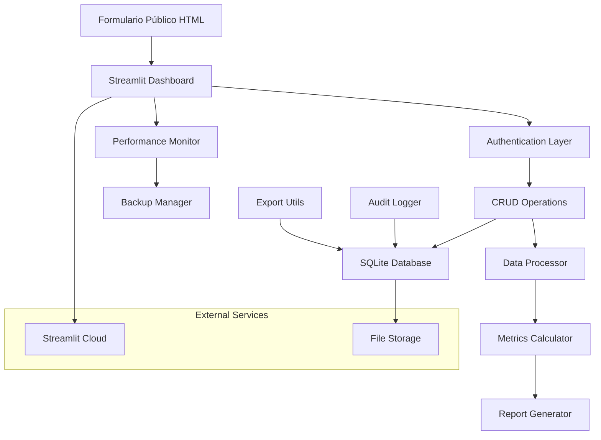

# Documentación Técnica - Sistema de Reportes Docentes

## Índice
1. [Arquitectura del Sistema](#arquitectura-del-sistema)
2. [Estructura del Proyecto](#estructura-del-proyecto)
3. [Configuración y Despliegue](#configuración-y-despliegue)
4. [Base de Datos](#base-de-datos)
5. [APIs y Endpoints](#apis-y-endpoints)
6. [Componentes Principales](#componentes-principales)
7. [Monitoreo y Logging](#monitoreo-y-logging)
8. [Backup y Recuperación](#backup-y-recuperación)
9. [Seguridad](#seguridad)
10. [Mantenimiento](#mantenimiento)
11. [Troubleshooting](#troubleshooting)

---

## Arquitectura del Sistema

### Stack Tecnológico

#### Frontend
- **Streamlit 1.28.1**: Framework principal para la interfaz web
- **Plotly 5.17.0**: Visualizaciones interactivas
- **HTML/CSS/JavaScript**: Formulario público

#### Backend
- **Python 3.9+**: Lenguaje principal
- **FastAPI 0.104.1**: API REST (para futuras extensiones)
- **SQLAlchemy 2.0.23**: ORM para base de datos
- **Pydantic 2.5.0**: Validación de datos

#### Base de Datos
- **SQLite**: Base de datos principal (desarrollo y producción pequeña)
- **Soporte para PostgreSQL**: Configuración disponible para producción

#### Procesamiento de Datos
- **Pandas 2.1.3**: Manipulación y análisis de datos
- **NumPy 1.25.2**: Cálculos numéricos
- **Scikit-learn 1.3.2**: Detección de duplicados y análisis

#### Generación de Reportes
- **Jinja2 3.1.2**: Templates para reportes
- **ReportLab 4.0.7**: Generación de PDFs
- **OpenPyXL 3.1.2**: Archivos Excel
- **python-pptx 0.6.23**: Presentaciones PowerPoint

#### Monitoreo
- **psutil 5.9.6**: Métricas del sistema
- **Custom monitoring**: Sistema propio de monitoreo de rendimiento

### Arquitectura de Componentes



---

## Estructura del Proyecto

```
sistema-reportes-docentes/
├── app/                          # Aplicación principal
│   ├── __init__.py
│   ├── startup.py               # Inicialización de la aplicación
│   ├── config.py                # Configuración global
│   │
│   ├── auth/                    # Autenticación
│   │   ├── __init__.py
│   │   └── streamlit_auth.py    # Sistema de autenticación
│   │
│   ├── core/                    # Lógica de negocio
│   │   ├── __init__.py
│   │   ├── audit_logger.py      # Sistema de auditoría
│   │   ├── data_processor.py    # Procesamiento de datos
│   │   ├── metrics_calculator.py # Cálculo de métricas
│   │   ├── performance_monitor.py # Monitoreo de rendimiento
│   │   ├── database_monitor.py  # Monitoreo de BD
│   │   ├── health_check.py      # Verificación de salud
│   │   ├── logging_middleware.py # Middleware de logging
│   │   └── error_handler.py     # Manejo de errores
│   │
│   ├── database/                # Capa de datos
│   │   ├── __init__.py
│   │   ├── connection.py        # Conexión a BD
│   │   ├── crud.py              # Operaciones CRUD
│   │   └── optimization.py      # Optimización de BD
│   │
│   ├── models/                  # Modelos de datos
│   │   ├── __init__.py
│   │   ├── database.py          # Modelos SQLAlchemy
│   │   ├── schemas.py           # Esquemas Pydantic
│   │   └── audit.py             # Modelos de auditoría
│   │
│   └── utils/                   # Utilidades
│       ├── __init__.py
│       ├── backup_manager.py    # Gestión de backups
│       └── export_utils.py      # Utilidades de exportación
│
├── dashboard/                   # Interfaz Streamlit
│   ├── streamlit_app.py         # Aplicación principal
│   ├── public_form.py           # Formulario público
│   │
│   ├── pages/                   # Páginas del dashboard
│   │   ├── __init__.py
│   │   ├── advanced_analytics.py
│   │   ├── audit_logs.py
│   │   ├── backup_management.py
│   │   ├── data_export.py
│   │   ├── form_review.py
│   │   ├── performance_dashboard.py
│   │   └── report_generation.py
│   │
│   └── components/              # Componentes reutilizables
│       ├── __init__.py
│       └── interactive_filters.py
│
├── docs/                        # Documentación
│   ├── MANUAL_ADMINISTRADOR.md
│   ├── DOCUMENTACION_TECNICA.md
│   └── GUIA_DESPLIEGUE.md
│
├── tests/                       # Pruebas
│   ├── test_integration_complete.py
│   ├── test_backup_system.py
│   ├── test_performance_monitoring.py
│   └── test_authentication.py
│
├── data/                        # Datos de la aplicación
├── logs/                        # Archivos de log
├── reports/                     # Reportes generados
├── uploads/                     # Archivos subidos
├── backups/                     # Backups del sistema
├── metrics/                     # Métricas de rendimiento
│
├── requirements.txt             # Dependencias Python
├── streamlit_config.toml        # Configuración Streamlit
├── .env.example                 # Variables de entorno ejemplo
├── README.md                    # Documentación principal
└── start_system.py              # Script de inicio
```

---

## Configuración y Despliegue

### Variables de Entorno

#### Archivo `.env`
```bash
# Base de Datos
DATABASE_URL=sqlite:///./data/reportes_docentes.db
DATABASE_POOL_SIZE=5
DATABASE_MAX_OVERFLOW=10

# Seguridad
SECRET_KEY=your-secret-key-here
JWT_SECRET=your-jwt-secret-here
ADMIN_PASSWORD_HASH=$2b$12$your-hashed-password-here

# Aplicación
APP_NAME=Sistema de Reportes Docentes
APP_VERSION=1.0.0
ENVIRONMENT=production
DEBUG=false
LOG_LEVEL=INFO

# Configuración de API
API_PREFIX=/api
CORS_ORIGINS=["*"]

# Almacenamiento
UPLOAD_DIR=uploads
REPORTS_DIR=reports
DATA_DIR=data
LOGS_DIR=logs

# Paginación
DEFAULT_PAGE_SIZE=20
MAX_PAGE_SIZE=100

# Rendimiento
CACHE_TTL=300
MAX_CONCURRENT_REQUESTS=10
REQUEST_TIMEOUT=30

# Email (opcional)
SMTP_SERVER=smtp.gmail.com
SMTP_PORT=587
EMAIL_USER=
EMAIL_PASSWORD=

# Monitoreo
ENABLE_MONITORING=true
MONITORING_INTERVAL=60
```

#### Configuración Streamlit (`streamlit_config.toml`)
```toml
[server]
port = 8501
enableCORS = false
enableXsrfProtection = false
maxUploadSize = 200

[browser]
gatherUsageStats = false
showErrorDetails = false

[theme]
primaryColor = "#1f77b4"
backgroundColor = "#ffffff"
secondaryBackgroundColor = "#f0f2f6"
textColor = "#262730"

[logger]
level = "info"
```

### Despliegue en Streamlit Cloud

#### 1. Preparación del Repositorio
```bash
# Asegurar que todos los archivos estén en Git
git add .
git commit -m "Prepare for deployment"
git push origin main
```

#### 2. Configuración en Streamlit Cloud
1. Conectar repositorio GitHub
2. Configurar archivo principal: `dashboard/streamlit_app.py`
3. Configurar variables de entorno en Streamlit Secrets

#### 3. Streamlit Secrets (`secrets.toml`)
```toml
[database]
DATABASE_URL = "sqlite:///./data/reportes_docentes.db"

[auth]
SECRET_KEY = "your-production-secret-key"
JWT_SECRET = "your-production-jwt-secret"
ADMIN_PASSWORD_HASH = "$2b$12$your-production-password-hash"

[app]
ENVIRONMENT = "production"
DEBUG = false
LOG_LEVEL = "INFO"

[email]
SMTP_SERVER = "smtp.gmail.com"
SMTP_PORT = 587
EMAIL_USER = "your-email@domain.com"
EMAIL_PASSWORD = "your-app-password"
```

### Despliegue Alternativo (Heroku)

#### 1. Archivos Requeridos

**`Procfile`**
```
web: streamlit run dashboard/streamlit_app.py --server.port=$PORT --server.address=0.0.0.0
```

**`runtime.txt`**
```
python-3.9.18
```

#### 2. Configuración Heroku
```bash
# Crear aplicación
heroku create your-app-name

# Configurar variables de entorno
heroku config:set SECRET_KEY=your-secret-key
heroku config:set ADMIN_PASSWORD_HASH=your-password-hash
heroku config:set ENVIRONMENT=production

# Desplegar
git push heroku main
```

---

## Base de Datos

### Esquema de Base de Datos

#### Tabla Principal: `formularios_envio`
```sql
CREATE TABLE formularios_envio (
    id INTEGER PRIMARY KEY AUTOINCREMENT,
    nombre_completo TEXT NOT NULL,
    correo_institucional TEXT NOT NULL,
    año_academico INTEGER,
    trimestre TEXT,
    estado TEXT DEFAULT 'PENDIENTE',
    fecha_envio DATETIME DEFAULT CURRENT_TIMESTAMP,
    fecha_revision DATETIME,
    revisado_por TEXT
);
```

#### Tablas Relacionadas
```sql
-- Cursos de Capacitación
CREATE TABLE cursos_capacitacion (
    id INTEGER PRIMARY KEY AUTOINCREMENT,
    formulario_id INTEGER REFERENCES formularios_envio(id),
    nombre_curso TEXT NOT NULL,
    fecha DATE NOT NULL,
    horas INTEGER NOT NULL
);

-- Publicaciones
CREATE TABLE publicaciones (
    id INTEGER PRIMARY KEY AUTOINCREMENT,
    formulario_id INTEGER REFERENCES formularios_envio(id),
    autores TEXT NOT NULL,
    titulo TEXT NOT NULL,
    evento_revista TEXT NOT NULL,
    estatus TEXT NOT NULL
);

-- Eventos Académicos
CREATE TABLE eventos_academicos (
    id INTEGER PRIMARY KEY AUTOINCREMENT,
    formulario_id INTEGER REFERENCES formularios_envio(id),
    nombre_evento TEXT NOT NULL,
    fecha DATE NOT NULL,
    tipo_participacion TEXT NOT NULL
);

-- [Tablas adicionales para otras categorías...]
```

#### Tabla de Auditoría
```sql
CREATE TABLE audit_logs (
    id INTEGER PRIMARY KEY AUTOINCREMENT,
    timestamp DATETIME DEFAULT CURRENT_TIMESTAMP,
    action TEXT NOT NULL,
    severity TEXT DEFAULT 'INFO',
    user_id TEXT,
    user_name TEXT,
    description TEXT NOT NULL,
    resource_type TEXT,
    resource_id TEXT,
    ip_address TEXT,
    extra_data TEXT,
    error_message TEXT
);
```

### Índices para Rendimiento
```sql
-- Índices principales
CREATE INDEX idx_formularios_estado ON formularios_envio(estado);
CREATE INDEX idx_formularios_fecha ON formularios_envio(fecha_envio);
CREATE INDEX idx_formularios_periodo ON formularios_envio(año_academico, trimestre);

-- Índices de relaciones
CREATE INDEX idx_cursos_formulario ON cursos_capacitacion(formulario_id);
CREATE INDEX idx_publicaciones_formulario ON publicaciones(formulario_id);
CREATE INDEX idx_eventos_formulario ON eventos_academicos(formulario_id);

-- Índices de auditoría
CREATE INDEX idx_audit_timestamp ON audit_logs(timestamp);
CREATE INDEX idx_audit_action ON audit_logs(action);
CREATE INDEX idx_audit_user ON audit_logs(user_id);
```

### Migraciones

#### Script de Migración: Agregar Período Académico
```python
# migrate_add_periodo.py
import sqlite3
from pathlib import Path

def migrate_add_periodo():
    """Add año_academico and trimestre columns"""
    
    db_path = Path("data/reportes_docentes.db")
    
    if not db_path.exists():
        print("Database not found")
        return
    
    conn = sqlite3.connect(db_path)
    cursor = conn.cursor()
    
    try:
        # Add new columns
        cursor.execute("ALTER TABLE formularios_envio ADD COLUMN año_academico INTEGER")
        cursor.execute("ALTER TABLE formularios_envio ADD COLUMN trimestre TEXT")
        
        # Update existing records with default values
        cursor.execute("""
            UPDATE formularios_envio 
            SET año_academico = 2024, trimestre = 'Q4' 
            WHERE año_academico IS NULL
        """)
        
        conn.commit()
        print("Migration completed successfully")
        
    except sqlite3.OperationalError as e:
        if "duplicate column name" in str(e):
            print("Columns already exist, skipping migration")
        else:
            raise e
    
    finally:
        conn.close()

if __name__ == "__main__":
    migrate_add_periodo()
```

---

## APIs y Endpoints

### Estructura de la API (FastAPI - Futuro)

#### Endpoints Principales
```python
# app/api/formularios.py
from fastapi import APIRouter, Depends, HTTPException
from app.database.crud import FormularioCRUD
from app.models.schemas import FormData, FormularioResponse

router = APIRouter(prefix="/formularios", tags=["formularios"])

@router.post("/", response_model=FormularioResponse)
async def create_formulario(
    form_data: FormData,
    crud: FormularioCRUD = Depends(get_crud)
):
    """Create new form submission"""
    return crud.create_formulario(form_data)

@router.get("/", response_model=List[FormularioResponse])
async def get_formularios(
    estado: Optional[EstadoFormulario] = None,
    skip: int = 0,
    limit: int = 100,
    crud: FormularioCRUD = Depends(get_crud)
):
    """Get formularios with filters"""
    return crud.get_formularios_by_estado(estado, skip, limit)

@router.put("/{formulario_id}/aprobar")
async def aprobar_formulario(
    formulario_id: int,
    admin_user: str,
    crud: FormularioCRUD = Depends(get_crud)
):
    """Approve formulario"""
    return crud.aprobar_formulario(formulario_id, admin_user)
```

#### Middleware de Autenticación
```python
# app/api/middleware.py
from fastapi import Request, HTTPException
from app.auth.streamlit_auth import verify_token

async def auth_middleware(request: Request, call_next):
    """Authentication middleware for API"""
    
    if request.url.path.startswith("/api/"):
        auth_header = request.headers.get("Authorization")
        
        if not auth_header or not auth_header.startswith("Bearer "):
            raise HTTPException(401, "Missing or invalid token")
        
        token = auth_header.split(" ")[1]
        
        if not verify_token(token):
            raise HTTPException(401, "Invalid token")
    
    response = await call_next(request)
    return response
```

---

## Componentes Principales

### 1. Sistema de Autenticación

#### Clase Principal: `StreamlitAuth`
```python
# app/auth/streamlit_auth.py
class StreamlitAuth:
    def __init__(self):
        self.config_file = "auth_config.json"
        self.session_timeout = 3600  # 1 hour
    
    def require_authentication(self) -> bool:
        """Require user authentication"""
        if not self._is_authenticated():
            self.show_login_form()
            return False
        
        if self._is_session_expired():
            self._logout()
            return False
        
        return True
    
    def authenticate_user(self, username: str, password: str) -> bool:
        """Authenticate user credentials"""
        # Implementation details...
    
    def _hash_password(self, password: str) -> str:
        """Hash password using bcrypt"""
        return bcrypt.hashpw(password.encode('utf-8'), bcrypt.gensalt()).decode('utf-8')
```

### 2. Procesador de Datos

#### Clase Principal: `DataProcessor`
```python
# app/core/data_processor.py
class DataProcessor:
    def __init__(self, db_session):
        self.db = db_session
    
    def clean_data(self, raw_data: List[Dict]) -> pd.DataFrame:
        """Clean and normalize data"""
        df = pd.DataFrame(raw_data)
        
        # Normalize dates
        df['fecha_envio'] = pd.to_datetime(df['fecha_envio'])
        
        # Clean text fields
        text_columns = ['nombre_completo', 'correo_institucional']
        for col in text_columns:
            if col in df.columns:
                df[col] = df[col].str.strip().str.title()
        
        return df
    
    def detect_duplicates(self, df: pd.DataFrame) -> pd.DataFrame:
        """Detect potential duplicates using fuzzy matching"""
        from sklearn.feature_extraction.text import TfidfVectorizer
        from sklearn.metrics.pairwise import cosine_similarity
        
        # Implementation details...
        return df
```

### 3. Calculadora de Métricas

#### Clase Principal: `MetricsCalculator`
```python
# app/core/metrics_calculator.py
class MetricsCalculator:
    def __init__(self, db_session):
        self.db = db_session
    
    def calculate_quarterly_metrics(self, df: pd.DataFrame, quarter: int, year: int) -> Dict:
        """Calculate metrics for specific quarter"""
        # Filter data for quarter
        quarter_data = df[
            (df['year'] == year) & 
            (df['quarter'] == quarter)
        ]
        
        return {
            'formularios_procesados': len(quarter_data),
            'resumen_actividades': self._calculate_activity_summary(quarter_data),
            'comparacion_anterior': self._compare_with_previous_quarter(quarter_data, quarter, year)
        }
    
    def calculate_annual_metrics(self, df: pd.DataFrame, year: int) -> Dict:
        """Calculate annual metrics"""
        # Implementation details...
```

### 4. Monitor de Rendimiento

#### Clase Principal: `PerformanceMonitor`
```python
# app/core/performance_monitor.py
class PerformanceMonitor:
    def __init__(self, max_history: int = 1000):
        self.max_history = max_history
        self.metrics_history = deque(maxlen=max_history)
        self.monitoring_active = False
    
    def start_monitoring(self, interval: int = 30):
        """Start background performance monitoring"""
        self.monitoring_active = True
        self.monitor_thread = threading.Thread(
            target=self._monitoring_loop,
            args=(interval,),
            daemon=True
        )
        self.monitor_thread.start()
    
    def _collect_system_metrics(self) -> PerformanceMetric:
        """Collect system performance metrics"""
        cpu_percent = psutil.cpu_percent(interval=1)
        memory = psutil.virtual_memory()
        disk = psutil.disk_usage('/')
        
        return PerformanceMetric(
            timestamp=datetime.utcnow(),
            cpu_percent=cpu_percent,
            memory_percent=memory.percent,
            memory_used_mb=memory.used / (1024 * 1024),
            disk_usage_percent=disk.percent,
            active_connections=len(psutil.net_connections())
        )
```

### 5. Gestor de Backups

#### Clase Principal: `BackupManager`
```python
# app/utils/backup_manager.py
class BackupManager:
    def __init__(self):
        self.backup_dir = Path("backups")
        self.backup_dir.mkdir(exist_ok=True)
    
    def create_backup(self, include_data: bool = True) -> Dict[str, Any]:
        """Create a complete backup of the database"""
        timestamp = datetime.now().strftime("%Y%m%d_%H%M%S")
        backup_name = f"backup_{timestamp}"
        backup_path = self.backup_dir / f"{backup_name}.zip"
        
        with zipfile.ZipFile(backup_path, 'w', zipfile.ZIP_DEFLATED) as backup_zip:
            # Backup database file
            backup_zip.write(self.db_path, "database.db")
            
            # Backup configuration
            if os.path.exists(".env"):
                backup_zip.write(".env", "config/.env")
            
            # Export data as JSON
            if include_data:
                data_export = self._export_data_as_json()
                backup_zip.writestr("data_export.json", json.dumps(data_export, indent=2, default=str))
        
        return {
            "success": True,
            "backup_path": str(backup_path),
            "backup_name": backup_name
        }
```

---

## Monitoreo y Logging

### Sistema de Logging

#### Configuración de Logging
```python
# app/core/logging_middleware.py
import logging
from datetime import datetime

class AppLogger:
    def __init__(self):
        self.logger = logging.getLogger("app")
        self.setup_logging()
    
    def setup_logging(self):
        """Configure application logging"""
        handler = logging.FileHandler("logs/application.log")
        formatter = logging.Formatter(
            '%(asctime)s - %(name)s - %(levelname)s - %(message)s'
        )
        handler.setFormatter(formatter)
        self.logger.addHandler(handler)
        self.logger.setLevel(logging.INFO)
    
    def log_operation(self, operation: str, details: Dict = None, level: str = "INFO", user_id: str = None):
        """Log application operations"""
        log_entry = {
            "operation": operation,
            "timestamp": datetime.utcnow().isoformat(),
            "user_id": user_id,
            "details": details or {}
        }
        
        message = f"Operation: {operation}"
        if details:
            message += f" | Details: {details}"
        if user_id:
            message += f" | User: {user_id}"
        
        getattr(self.logger, level.lower())(message)
```

### Métricas de Rendimiento

#### Estructura de Métricas
```python
@dataclass
class PerformanceMetric:
    timestamp: datetime
    cpu_percent: float
    memory_percent: float
    memory_used_mb: float
    disk_usage_percent: float
    active_connections: int
    response_time_ms: Optional[float] = None
    request_count: int = 0
    error_count: int = 0

@dataclass
class DatabaseMetrics:
    timestamp: datetime
    query_count: int
    avg_query_time_ms: float
    slow_queries: int
    connection_pool_size: int
    active_connections: int
    total_forms: int
    pending_forms: int
```

### Alertas de Rendimiento

#### Configuración de Alertas
```python
# Umbrales por defecto
CPU_THRESHOLD = 80.0          # 80% CPU
MEMORY_THRESHOLD = 85.0       # 85% Memory
RESPONSE_TIME_THRESHOLD = 5000.0  # 5 seconds

def check_performance_alerts(metric: PerformanceMetric):
    """Check for performance alerts"""
    alerts = []
    
    if metric.cpu_percent > CPU_THRESHOLD:
        alerts.append(f"High CPU usage: {metric.cpu_percent:.1f}%")
    
    if metric.memory_percent > MEMORY_THRESHOLD:
        alerts.append(f"High memory usage: {metric.memory_percent:.1f}%")
    
    if metric.response_time_ms and metric.response_time_ms > RESPONSE_TIME_THRESHOLD:
        alerts.append(f"Slow response time: {metric.response_time_ms:.1f}ms")
    
    if alerts:
        log_alert(alerts)
```

---

## Backup y Recuperación

### Estrategia de Backup

#### Tipos de Backup
1. **Backup Completo**: Base de datos + configuración + datos JSON
2. **Backup Incremental**: Solo cambios desde último backup
3. **Backup de Configuración**: Solo archivos de configuración

#### Programación de Backups
```python
# Backup automático diario
def schedule_daily_backup():
    """Schedule daily backup at 2 AM"""
    import schedule
    
    schedule.every().day.at("02:00").do(create_automatic_backup)
    
    while True:
        schedule.run_pending()
        time.sleep(3600)  # Check every hour

def create_automatic_backup():
    """Create automatic backup with cleanup"""
    backup_result = backup_manager.create_backup(include_data=True)
    
    if backup_result["success"]:
        # Keep only last 30 backups
        backup_manager.cleanup_old_backups(keep_count=30)
        
        # Log success
        audit_logger.log_action(
            "AUTOMATIC_BACKUP_CREATED",
            f"Automatic backup created: {backup_result['backup_name']}"
        )
```

### Procedimientos de Recuperación

#### Recuperación Completa
```bash
# 1. Detener la aplicación
sudo systemctl stop streamlit-app

# 2. Crear backup de seguridad de datos actuales
cp data/reportes_docentes.db data/reportes_docentes_backup.db

# 3. Restaurar desde backup
python -c "
from app.utils.backup_manager import backup_manager
result = backup_manager.restore_backup('backups/backup_YYYYMMDD_HHMMSS.zip')
print(result)
"

# 4. Verificar integridad
python -c "
from app.database.connection import SessionLocal
from app.database.crud import FormularioCRUD
db = SessionLocal()
crud = FormularioCRUD(db)
stats = crud.get_estadisticas_generales()
print(f'Total forms: {stats[\"total_formularios\"]}')
db.close()
"

# 5. Reiniciar aplicación
sudo systemctl start streamlit-app
```

#### Recuperación Parcial
```python
# Recuperar solo datos específicos
def restore_specific_data(backup_path: str, table_name: str):
    """Restore specific table from backup"""
    
    # Extract backup
    with zipfile.ZipFile(backup_path, 'r') as backup_zip:
        backup_zip.extractall("temp_restore")
    
    # Read JSON data
    with open("temp_restore/data_export.json", 'r') as f:
        data = json.load(f)
    
    # Restore specific table data
    if table_name == "formularios":
        restore_formularios_data(data["forms"])
    elif table_name == "audit_logs":
        restore_audit_data(data.get("audit_logs", []))
    
    # Cleanup
    shutil.rmtree("temp_restore")
```

---

## Seguridad

### Autenticación y Autorización

#### Hash de Contraseñas
```python
import bcrypt

def hash_password(password: str) -> str:
    """Hash password using bcrypt"""
    salt = bcrypt.gensalt()
    return bcrypt.hashpw(password.encode('utf-8'), salt).decode('utf-8')

def verify_password(password: str, hashed: str) -> bool:
    """Verify password against hash"""
    return bcrypt.checkpw(password.encode('utf-8'), hashed.encode('utf-8'))
```

#### Gestión de Sesiones
```python
class SessionManager:
    def __init__(self):
        self.session_timeout = 3600  # 1 hour
    
    def create_session(self, user_id: str) -> str:
        """Create new session"""
        session_id = secrets.token_urlsafe(32)
        session_data = {
            "user_id": user_id,
            "created_at": datetime.utcnow(),
            "last_activity": datetime.utcnow()
        }
        
        st.session_state["session_id"] = session_id
        st.session_state["session_data"] = session_data
        
        return session_id
    
    def validate_session(self, session_id: str) -> bool:
        """Validate session"""
        if not session_id or session_id != st.session_state.get("session_id"):
            return False
        
        session_data = st.session_state.get("session_data")
        if not session_data:
            return False
        
        # Check timeout
        last_activity = session_data["last_activity"]
        if datetime.utcnow() - last_activity > timedelta(seconds=self.session_timeout):
            return False
        
        # Update last activity
        session_data["last_activity"] = datetime.utcnow()
        st.session_state["session_data"] = session_data
        
        return True
```

### Validación de Datos

#### Sanitización de Entrada
```python
import re
from html import escape

def sanitize_string(input_str: str, max_length: int = 1000) -> str:
    """Sanitize string input"""
    if not input_str:
        return ""
    
    # Remove HTML tags
    clean_str = re.sub(r'<[^>]+>', '', input_str)
    
    # Escape HTML entities
    clean_str = escape(clean_str)
    
    # Limit length
    clean_str = clean_str[:max_length]
    
    # Remove excessive whitespace
    clean_str = re.sub(r'\s+', ' ', clean_str).strip()
    
    return clean_str

def validate_email(email: str) -> bool:
    """Validate email format"""
    pattern = r'^[a-zA-Z0-9._%+-]+@[a-zA-Z0-9.-]+\.[a-zA-Z]{2,}$'
    return re.match(pattern, email) is not None
```

### Protección contra Ataques

#### Rate Limiting
```python
from collections import defaultdict
from datetime import datetime, timedelta

class RateLimiter:
    def __init__(self, max_requests: int = 100, window_minutes: int = 15):
        self.max_requests = max_requests
        self.window = timedelta(minutes=window_minutes)
        self.requests = defaultdict(list)
    
    def is_allowed(self, client_ip: str) -> bool:
        """Check if request is allowed"""
        now = datetime.utcnow()
        
        # Clean old requests
        self.requests[client_ip] = [
            req_time for req_time in self.requests[client_ip]
            if now - req_time < self.window
        ]
        
        # Check limit
        if len(self.requests[client_ip]) >= self.max_requests:
            return False
        
        # Add current request
        self.requests[client_ip].append(now)
        return True
```

---

## Mantenimiento

### Tareas de Mantenimiento Rutinario

#### Script de Mantenimiento Diario
```python
# maintenance/daily_maintenance.py
def daily_maintenance():
    """Execute daily maintenance tasks"""
    
    print("Starting daily maintenance...")
    
    # 1. Database optimization
    optimize_database()
    
    # 2. Clean old logs
    cleanup_old_logs(days_to_keep=30)
    
    # 3. Clean old metrics
    cleanup_old_metrics(days_to_keep=7)
    
    # 4. Verify backup integrity
    verify_recent_backups()
    
    # 5. Generate health report
    generate_health_report()
    
    print("Daily maintenance completed")

def optimize_database():
    """Optimize database performance"""
    from app.database.optimization import db_optimizer
    
    db_optimizer.analyze_tables()
    db_optimizer.vacuum_database()
    db_optimizer.update_statistics()

def cleanup_old_logs(days_to_keep: int = 30):
    """Clean up old log files"""
    cutoff_date = datetime.now() - timedelta(days=days_to_keep)
    
    logs_dir = Path("logs")
    for log_file in logs_dir.glob("*.log"):
        if log_file.stat().st_mtime < cutoff_date.timestamp():
            log_file.unlink()
            print(f"Deleted old log file: {log_file}")
```

#### Script de Mantenimiento Semanal
```python
# maintenance/weekly_maintenance.py
def weekly_maintenance():
    """Execute weekly maintenance tasks"""
    
    print("Starting weekly maintenance...")
    
    # 1. Create full backup
    create_weekly_backup()
    
    # 2. Analyze performance trends
    analyze_performance_trends()
    
    # 3. Check for system updates
    check_system_updates()
    
    # 4. Generate weekly report
    generate_weekly_report()
    
    print("Weekly maintenance completed")

def create_weekly_backup():
    """Create weekly backup with verification"""
    from app.utils.backup_manager import backup_manager
    
    backup_result = backup_manager.create_backup(include_data=True)
    
    if backup_result["success"]:
        # Verify backup
        verification = backup_manager.verify_backup_integrity(backup_result["backup_path"])
        
        if verification["success"]:
            print(f"Weekly backup created and verified: {backup_result['backup_name']}")
        else:
            print(f"Weekly backup created but verification failed: {verification['error']}")
    else:
        print(f"Weekly backup failed: {backup_result['error']}")
```

### Monitoreo de Salud del Sistema

#### Health Check Endpoint
```python
# app/core/health_check.py
class HealthChecker:
    def get_system_health(self) -> Dict[str, Any]:
        """Get comprehensive system health status"""
        
        health_status = {
            "timestamp": datetime.utcnow().isoformat(),
            "status": "healthy",
            "checks": {}
        }
        
        # Database connectivity
        health_status["checks"]["database"] = self._check_database()
        
        # Disk space
        health_status["checks"]["disk_space"] = self._check_disk_space()
        
        # Memory usage
        health_status["checks"]["memory"] = self._check_memory()
        
        # Recent errors
        health_status["checks"]["recent_errors"] = self._check_recent_errors()
        
        # Determine overall status
        if any(check["status"] == "critical" for check in health_status["checks"].values()):
            health_status["status"] = "critical"
        elif any(check["status"] == "warning" for check in health_status["checks"].values()):
            health_status["status"] = "warning"
        
        return health_status
    
    def _check_database(self) -> Dict[str, Any]:
        """Check database connectivity and performance"""
        try:
            db = SessionLocal()
            start_time = time.time()
            
            # Simple query to test connectivity
            result = db.execute("SELECT COUNT(*) FROM formularios_envio").scalar()
            
            query_time = (time.time() - start_time) * 1000
            db.close()
            
            status = "healthy"
            if query_time > 1000:  # > 1 second
                status = "warning"
            if query_time > 5000:  # > 5 seconds
                status = "critical"
            
            return {
                "status": status,
                "response_time_ms": query_time,
                "total_records": result
            }
            
        except Exception as e:
            return {
                "status": "critical",
                "error": str(e)
            }
```

---

## Troubleshooting

### Problemas Comunes y Soluciones

#### 1. Error de Conexión a Base de Datos
**Síntomas**: `sqlite3.OperationalError: database is locked`

**Causas**:
- Múltiples conexiones simultáneas
- Proceso anterior no cerró conexión correctamente
- Archivo de base de datos corrupto

**Soluciones**:
```python
# Verificar conexiones activas
def check_active_connections():
    import psutil
    
    for proc in psutil.process_iter(['pid', 'name', 'open_files']):
        try:
            if proc.info['name'] and 'python' in proc.info['name']:
                for file in proc.info['open_files'] or []:
                    if 'reportes_docentes.db' in file.path:
                        print(f"Process {proc.info['pid']} has database open")
        except (psutil.NoSuchProcess, psutil.AccessDenied):
            pass

# Forzar cierre de conexiones
def force_close_connections():
    """Force close all database connections"""
    from app.database.connection import engine
    
    engine.dispose()
    print("All database connections closed")
```

#### 2. Error de Memoria Insuficiente
**Síntomas**: `MemoryError` o rendimiento muy lento

**Causas**:
- Procesamiento de datasets muy grandes
- Acumulación de datos en memoria
- Falta de limpieza de objetos

**Soluciones**:
```python
# Procesamiento por lotes
def process_large_dataset_in_batches(batch_size: int = 1000):
    """Process large datasets in batches"""
    
    db = SessionLocal()
    try:
        total_count = db.query(FormularioEnvioDB).count()
        
        for offset in range(0, total_count, batch_size):
            batch = db.query(FormularioEnvioDB).offset(offset).limit(batch_size).all()
            
            # Process batch
            process_batch(batch)
            
            # Clear memory
            del batch
            gc.collect()
            
    finally:
        db.close()

# Monitoreo de memoria
def monitor_memory_usage():
    """Monitor memory usage"""
    import psutil
    
    process = psutil.Process()
    memory_info = process.memory_info()
    
    print(f"RSS: {memory_info.rss / 1024 / 1024:.2f} MB")
    print(f"VMS: {memory_info.vms / 1024 / 1024:.2f} MB")
    
    return memory_info.rss / 1024 / 1024  # Return RSS in MB
```

#### 3. Error en Generación de Reportes
**Síntomas**: Reportes vacíos o con formato incorrecto

**Causas**:
- Datos insuficientes para el período seleccionado
- Errores en templates de reportes
- Problemas con librerías de generación

**Soluciones**:
```python
# Validación de datos antes de generar reporte
def validate_data_for_report(year: int, quarter: int = None) -> Dict[str, Any]:
    """Validate data availability for report generation"""
    
    db = SessionLocal()
    try:
        crud = FormularioCRUD(db)
        
        # Check approved forms for period
        approved_forms = crud.get_formularios_by_estado(EstadoFormularioEnum.APROBADO)
        
        period_forms = []
        for form in approved_forms:
            if hasattr(form, 'año_academico') and form.año_academico == year:
                if quarter is None or (hasattr(form, 'trimestre') and form.trimestre == f"Q{quarter}"):
                    period_forms.append(form)
        
        validation_result = {
            "has_data": len(period_forms) > 0,
            "form_count": len(period_forms),
            "issues": []
        }
        
        if len(period_forms) == 0:
            validation_result["issues"].append("No approved forms found for the specified period")
        
        # Check for required activities
        total_activities = 0
        for form in period_forms:
            total_activities += len(form.cursos_capacitacion or [])
            total_activities += len(form.publicaciones or [])
            total_activities += len(form.eventos_academicos or [])
        
        if total_activities == 0:
            validation_result["issues"].append("No academic activities found in approved forms")
        
        validation_result["total_activities"] = total_activities
        
        return validation_result
        
    finally:
        db.close()

# Regenerar reporte con logging detallado
def regenerate_report_with_debug(year: int, quarter: int = None):
    """Regenerate report with detailed logging"""
    
    print(f"Starting report generation for {year} Q{quarter if quarter else 'All'}")
    
    # Validate data
    validation = validate_data_for_report(year, quarter)
    print(f"Data validation: {validation}")
    
    if not validation["has_data"]:
        print("Cannot generate report: insufficient data")
        return None
    
    # Generate report with error handling
    try:
        # Implementation details...
        print("Report generated successfully")
        
    except Exception as e:
        print(f"Error generating report: {e}")
        import traceback
        traceback.print_exc()
        return None
```

#### 4. Problemas de Rendimiento
**Síntomas**: Aplicación lenta o timeouts

**Diagnóstico**:
```python
# Profiling de rendimiento
def profile_performance():
    """Profile application performance"""
    import cProfile
    import pstats
    
    profiler = cProfile.Profile()
    profiler.enable()
    
    # Execute operation to profile
    # ... your code here ...
    
    profiler.disable()
    
    # Analyze results
    stats = pstats.Stats(profiler)
    stats.sort_stats('cumulative')
    stats.print_stats(20)  # Top 20 functions

# Optimización de consultas
def optimize_database_queries():
    """Optimize database queries"""
    
    # Add missing indexes
    db = SessionLocal()
    try:
        db.execute("CREATE INDEX IF NOT EXISTS idx_formularios_periodo ON formularios_envio(año_academico, trimestre)")
        db.execute("CREATE INDEX IF NOT EXISTS idx_audit_recent ON audit_logs(timestamp DESC)")
        db.commit()
        
        # Analyze tables
        db.execute("ANALYZE")
        db.commit()
        
        print("Database optimization completed")
        
    finally:
        db.close()
```

### Logs de Diagnóstico

#### Habilitar Logging Detallado
```python
# Enable debug logging
import logging

logging.basicConfig(
    level=logging.DEBUG,
    format='%(asctime)s - %(name)s - %(levelname)s - %(message)s',
    handlers=[
        logging.FileHandler('logs/debug.log'),
        logging.StreamHandler()
    ]
)

# SQLAlchemy query logging
logging.getLogger('sqlalchemy.engine').setLevel(logging.INFO)
```

#### Análisis de Logs
```bash
# Buscar errores recientes
grep -i error logs/application.log | tail -20

# Contar tipos de eventos
grep -o '"action":"[^"]*"' logs/application.log | sort | uniq -c

# Analizar rendimiento de queries
grep "DB Operation" logs/application.log | grep -o "took [0-9.]*s" | sort -n
```

---

## Contacto y Soporte

### Información de Contacto
- **Desarrollador**: [Nombre del desarrollador]
- **Email**: [email@domain.com]
- **Repositorio**: [URL del repositorio GitHub]

### Reportar Problemas
Al reportar problemas, incluya:
1. Descripción detallada del problema
2. Pasos para reproducir
3. Logs relevantes
4. Información del entorno (OS, Python version, etc.)
5. Capturas de pantalla si aplica

---

*Documento actualizado: Octubre 2024*
*Versión del Sistema: 1.0.0*